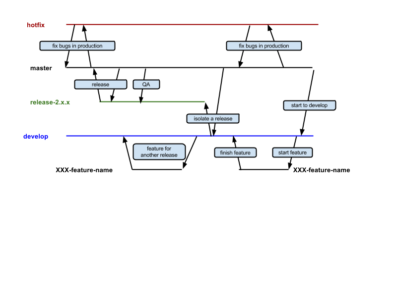

Git workflow
------------

Git Flow
^^^^^^^^

We’re using GitFlow more or less as described here:

* http://blog.sourcetreeapp.com/2012/08/01/smart-branching-with-sourcetree-and-git-flow/

Branching
^^^^^^^^^

* Each project has it’s own develop branch
* All feature branches use this branch as upstream
* We use rebasing to sync the commits as we branch out
* Before each release we create a release branch to isolate the release related code
* When we merge back to master (or to develop from feature branches) we use merge (with GitHub pull request)
* develop branch have to be updated with the latest code on master often (at least daily)

Useful commands
^^^^^^^^^^^^^^^

Add commands from `profile_workflow_commands`_ into your ~/.profile::

    cat profile_workflow_commands >> ~/.profile

You can also add aliases from `profile_aliases`_ into your ~/.profile::

    cat profile_aliases >> ~/.profile

Switching between projects
^^^^^^^^^^^^^^^^^^^^^^^^^^

To set a default develop branch set the DEVELOP env variable::

    export DEVELOP="LOC-develop"

.. _profile_workflow_commands: ./profile_workflow_commands
.. _profile_aliases: ./profile_aliases
